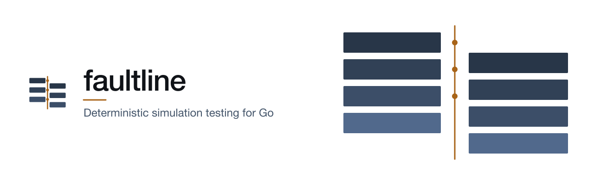

  <picture>
    <source media="(prefers-color-scheme: dark)" srcset=".github/assets/readme-dark.svg">
    
  </picture>

  Find the bugs in your distributed system before production does.

> [!WARNING]
> faultline is under heavy development and is not ready to use yet. Anything can change until the
> first release.
>
> The first version, **v0.1.0**, is planned for **October 19, 2026**. You can follow the work on the
> [v0.1.0 milestone](https://github.com/hmdsefi/faultline/milestone/1).

## What it does

Some bugs in distributed systems only show up under rare conditions, for example a network split
during a leader election, or a crash right after a write that never reached the disk. Normal tests
almost never hit these cases, and when production does, the bug is very hard to reproduce.

faultline runs your Go code in a simulated world. Time, the network and the disk are all simulated,
and every random choice comes from one number: the seed. faultline uses the seed to inject faults,
such as delayed or dropped messages, network partitions, crashes and failed disk writes. When a
test fails, you run the same seed again and get exactly the same run, so you can debug it step by
step. Everything happens inside `go test`.

## What v0.1.0 will include

- A simulation kernel with virtual time and a seeded scheduler
- A simulated network and disk
- Fault injection, with exact replay of any failing seed
- A test API you call from `go test`
- Failure reports you can read and replay
- A ready-made test setup for [etcd/raft](https://github.com/etcd-io/raft)

## Why the name

A fault line is a crack in the earth's crust. Stress builds up there for years without any sign,
and then it is released all at once in an earthquake. Bugs in distributed systems often behave the
same way. In software, a "fault" is also the usual word for something going wrong, like a crashed
server or a lost message. faultline helps you find those weak spots in a test instead of in
production.

## What it is not

faultline is not a chaos engineering tool like Chaos Monkey. It never touches real servers or real
networks. Everything runs inside your test process, so failures are quick to find and easy to
reproduce.

## Related projects

[lockstep](https://github.com/hmdsefi/lockstep) is a separate project for writing deterministic
actors in Go. Its simulation mode uses faultline's `kernel` package. faultline does not depend on
lockstep.

faultline itself depends only on the Go standard library and
[gograph](https://github.com/hmdsefi/gograph), which it uses for network topology and partitions,
cycle detection, and diagrams of failing runs.

## License

faultline is licensed under the Apache License 2.0. See [LICENSE](LICENSE).
