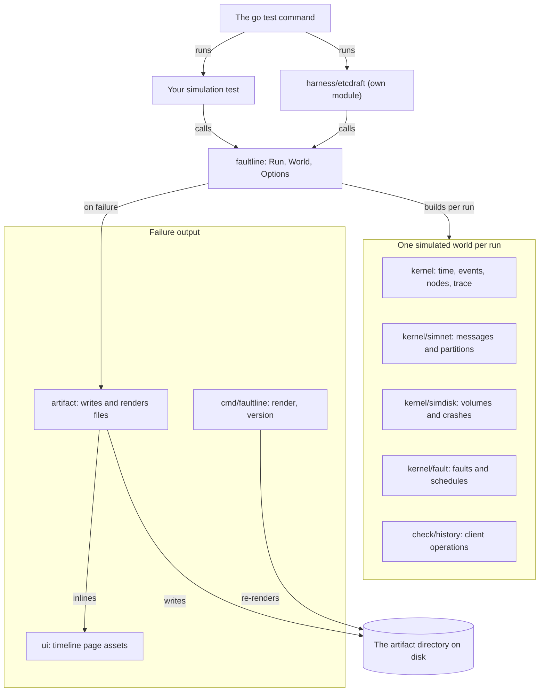

# Architecture

faultline is a Go library built around one single-threaded simulator, plus a command-line tool and a
separate module for etcd/raft. This page shows what each package owns, how one seed moves through
them, and why the design looks the way it does. It covers the packages in v0.1.0.

## The packages

A test calls `faultline.Run`, which builds a fresh simulated world for every run from the kernel and
the packages around it. A failing run goes to package `artifact`, which writes the files you debug
with.

The packages do these jobs:

- `faultline`, the module root, is the test entry point: `Run`, `Options` and `World`. It reads the
  `FAULTLINE_*` environment variables, derives the seed list and runs each seed as a subtest. It
  runs the checks, classifies failures, runs failing seeds a second time and prints the report. It
  and the etcd/raft harness are the only packages on this page that import `testing`.
- `kernel` is the discrete-event simulator. It owns virtual time, the event queue and its seeded
  tie-break, the named random streams, and nodes with their incarnations, crashes, pauses and
  clocks. It also keeps the trace and its running hash. It starts no goroutines and imports only the
  standard library.
- `kernel/simnet` is the network. It models links with latency, jitter, loss, duplication and FIFO
  order. It keeps the topology as a directed graph in gograph, which answers questions such as which
  nodes still have direct links to a quorum.
- `kernel/simdisk` is the disk: one volume per node, unsynced writes and metadata, crash models,
  failed syncs, capacity and corruption.
- `kernel/fault` treats faults as data. It holds fault events, schedules and their JSON format, the
  injector that applies and records faults, and the planners `Random`, `Script` and `None`.
- `check/history` records client operations, and reads and writes `history.jsonl`.
- `artifact` reads and writes the artifact directory. It renders `timeline.txt`, `hb.mmd` and
  `timeline.html` from the trace. Its functions depend only on their inputs: no clock, no
  randomness, no environment.
- `ui` embeds the web assets that `timeline.html` inlines, and imports only the standard library.
- `cmd/faultline` is the `faultline` command. `faultline render <dir>` regenerates the three
  rendered files of an artifact directory, and `faultline version` prints the version.
- `harness/etcdraft` is a separate Go module. It runs clusters of `go.etcd.io/raft/v3` v3.7.0 inside
  faultline, with a write-ahead log on the simulated disk and a key-value state machine. It adds
  clients recorded in the history, fault presets, and safety and liveness checks. Most tests call
  `etcdraft.Test`.

Imports go in one direction. `simnet` and `simdisk` build on `kernel`, and `fault` builds on those
three. Nothing in the simulation imports `faultline` or `artifact`. A test in faultline's suite
checks these import rules.

## How one seed runs

Each seed is a subtest, and each subtest runs one or more attempts of the same run. An attempt
builds a new kernel, network, disk and planner state, and calls your world function again. The
attempts of a seed share only the seed and the options, which is why the world function builds all
of its state from `w`.

By default the first attempt keeps only the trace hash, so a passing seed costs little memory. If
the first attempt fails, faultline runs a second attempt that keeps every record. The second trace
hash must equal the first. faultline then writes the artifact directory from the second attempt and
prints the report.

With `FAULTLINE_CHECK_DETERMINISM=1`, a passing seed also gets a second attempt, and a different
trace hash fails the seed. When two attempts differ, faultline runs the seed with full traces until
it has two traces to compare. It reports the first record where they differ, and a list of common
causes.

## Design choices

The first two choices follow from one requirement: a seed gives the same run on every supported
platform. The other two keep faultline out of the way of a module's other tests and dependencies.

### One thread, discrete events

The kernel runs every callback on one goroutine, one at a time, in an order fixed by virtual time
and the seed. A simulator with real goroutines would need the Go scheduler to make the same choices
in every run, and the Go scheduler takes no seed. With one thread and an event queue, the queue is
the only source of ordering, and the queue is seeded. The cost is that code under test is written as
callbacks. v0.1.0 does not run goroutine code.

### Named streams and integer decisions

Each node, link, disk and planner draws from its own random stream. A change in one part of a run
changes the draws of the streams that part uses. Every other stream still produces the same
sequence of numbers. With one shared generator, a single extra draw would shift every later random
decision in the run.

Random decisions use integers: probabilities in parts per million and durations in nanoseconds. The
[Go specification](https://go.dev/ref/spec#Floating_point_operators) lets a compiler fuse a multiply
and an add into one instruction, so a float result can differ between amd64 and arm64. Integers give
the same answer on both, and a seed gives the same run on both.

### Environment variables, not flags

faultline reads its settings from `FAULTLINE_*` environment variables. `go test ./...` passes a test
flag to every package's test binary, and a binary that does not define the flag fails. An
environment variable reaches every test binary, and the ones that do not use faultline ignore it.

### A small dependency footprint

The root module depends on the standard library and [gograph](https://github.com/hmdsefi/gograph)
only. Anything heavier lives in a nested module with its own `go.mod`. `harness/etcdraft` requires
etcd/raft and protobuf, and a project that does not import the harness does not depend on them.

## How faultline checks its own determinism

faultline holds its own simulation packages to the rules it asks of your code, and its test suite
checks them:

- A lint test parses the simulation packages. It rejects `go` statements and `select`, ranging over
  a map without sorting, wall-clock time, package-level random functions and `crypto/rand`. It also
  rejects environment reads, floating point in decision code, and files limited to one operating
  system or CPU.
- CI runs the whole suite with `FAULTLINE_CHECK_DETERMINISM=1`, so every passing seed of every test
  runs twice and must give the same trace hash.
- Golden trace hashes pin the exact runs of a set of small scenarios. CI computes them on Linux on
  amd64 and macOS on arm64, with Go 1.26 and Go 1.27, and fails when any two disagree.

## Next steps

- [How faultline works](how-it-works.md): time, the scheduler, the network, the disk, faults and
  replay.
- [Use faultline with an AI coding agent](ai-agents.md): the loop from a failing seed to a pinned
  regression test.
